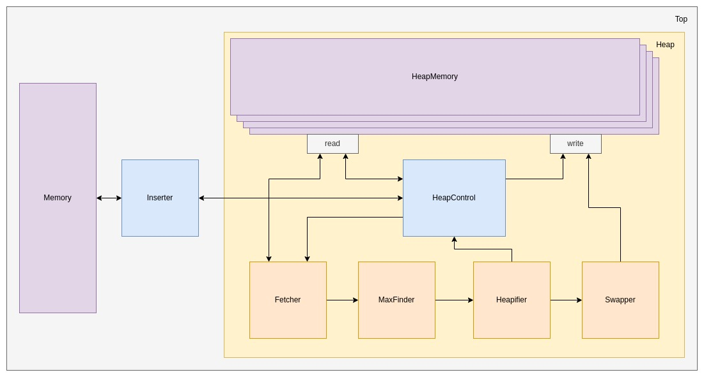

# Heap sort in hardware

# Raspberry Pi experiment

Run `make executables` to create the binaries for `K={2,4,8,16,32,64,128}` and `N={4096,6144,8192,10240,12288,14336,16384}`. Run `./src/scripts/test4RasperryPiC.sh` to run the experiment. The results are logged to `results/runtime.log`.